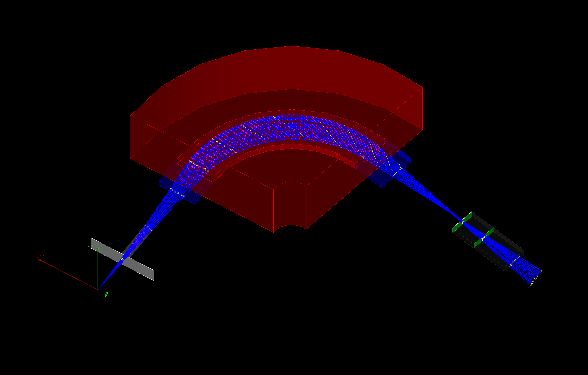
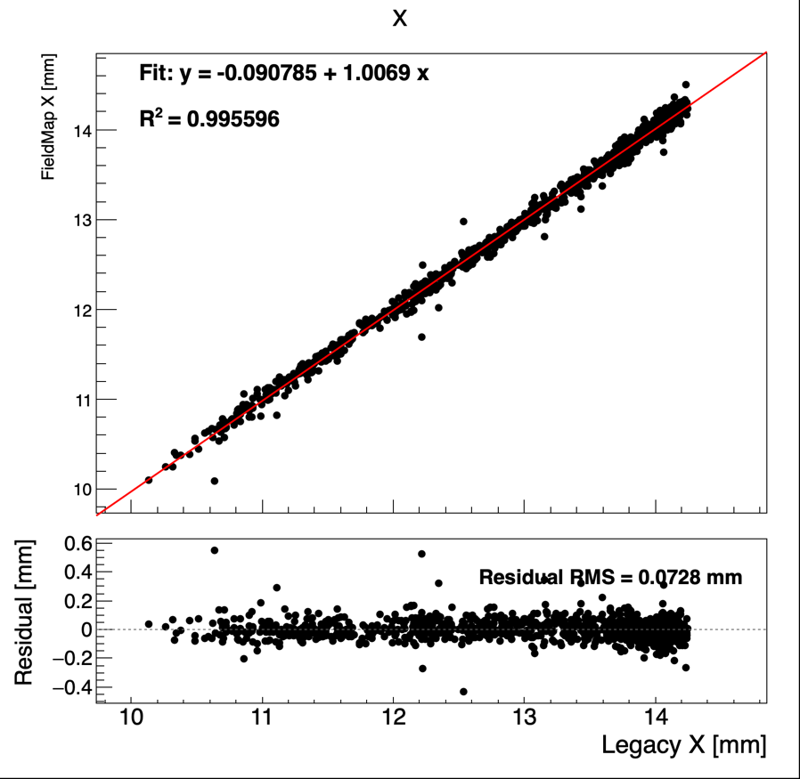
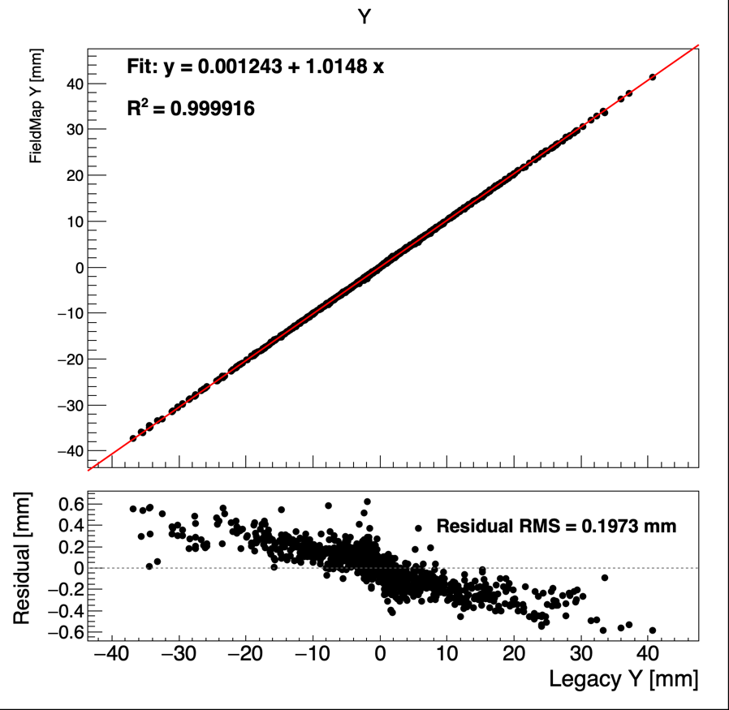
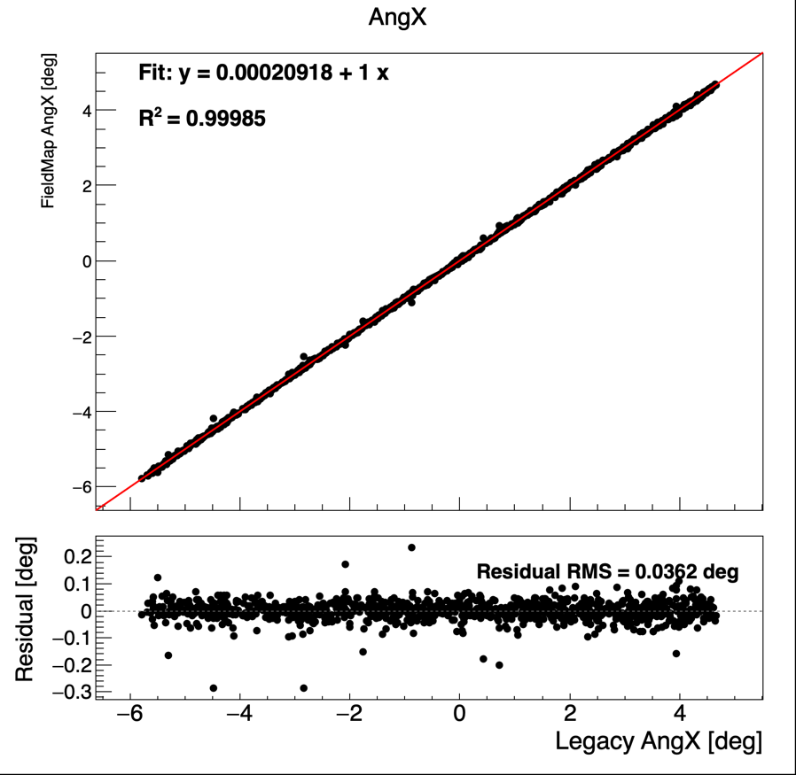
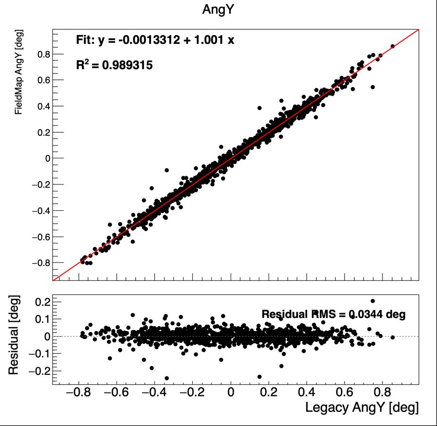

# MdmSim

MdmSim is a Geant4 simulation for ions passing through the MDM spectrometer. It
tracks particles from the target chamber, through the slit/collimator and MDM
magnetic system, to the focal-plane PPACs. The code also models a dE-E silicon
telescope in the target chamber.

The magnetic field model is map based. The field maps must be generated by
[MDMTrace](https://github.com/luozf14/MDMTrace), copied into this project's
`field/` directory, and loaded at run time by MdmSim. MDMTrace builds those maps
directly from the original RAYTRACE code and the original MDM spectrometer input
deck, `rayin.dat`. MdmSim then uses trilinear 3D interpolation to evaluate
`Bx`, `By`, and `Bz` at each requested `(x, y, z)` point. Geant4 performs the
actual particle tracking through those interpolated fields.

## Required Before Running

MdmSim will not run with a fresh clone until the magnetic-field map files are
present. This repository expects a `field/` directory containing the four binary
maps generated by [MDMTrace](https://github.com/luozf14/MDMTrace):

```text
field/Multipole.bin
field/DipoleEntrance.bin
field/DipoleSector.bin
field/DipoleExit.bin
```

Create the directory and copy the generated maps before running MdmSim:

```sh
mkdir -p field
cp /path/to/MDMTrace/field/Multipole.bin field/
cp /path/to/MDMTrace/field/DipoleEntrance.bin field/
cp /path/to/MDMTrace/field/DipoleSector.bin field/
cp /path/to/MDMTrace/field/DipoleExit.bin field/
```

The copied map metadata must match the `DipoleProbe` and
`FirstMultipoleProbe` values in `config/config.json`; MdmSim checks this at
startup and stops with an error if the probes do not match.

## What This Project Does

- Simulates ion trajectories through the MDM spectrometer with Geant4.
- Uses magnetic-field maps generated by
  [MDMTrace](https://github.com/luozf14/MDMTrace) instead of analytic field
  formulas.
- Loads four field maps: `Multipole.bin`, `DipoleEntrance.bin`,
  `DipoleSector.bin`, and `DipoleExit.bin`.
- Evaluates the magnetic field at arbitrary points with trilinear interpolation.
- Models the target chamber, target, optional dE silicon detector, E silicon
  detector, slit/collimator, MDM multipole and dipole field regions, and two
  PPACs near the focal plane.
- Writes detailed ROOT output for detector hits, PPAC tracks, and legacy
  MDMTrace comparison values.
- Provides a ROOT comparison macro for checking Geant4 field-map tracking
  against the legacy RAYTRACE/MDMTrace transport.

## Simulation Flow

1. Primary ions are generated at the target.
2. Geant4 transports the particles through the target chamber and silicon
   telescope geometry.
3. Particles passing the slit/collimator enter the MDM spectrometer field
   volumes.
4. The multipole and dipole field classes transform the Geant4 world position
   into the corresponding MDMTrace field-map coordinate system.
5. `MdmFieldMap` returns the interpolated local magnetic-field vector in Tesla.
6. The field wrapper rotates that vector back into the Geant4 global frame.
7. Geant4 integrates the trajectory through the fields and records PPAC hits.
8. Legacy MDMTrace values are also stored so the field-map result can be
   compared with the original RAYTRACE transport.

## Demo

<td></td>

## Magnetic Field Maps

MdmSim does not generate magnetic-field maps by itself. A fresh clone needs a
manually created `field/` directory populated with the MDMTrace output files
before any simulation can run. Generate the maps with
[MDMTrace](https://github.com/luozf14/MDMTrace), then copy the resulting binary
maps into this repository's `field/` directory.
MDMTrace may use AME2020 masses when tuning the magnet settings and generating
the maps. MdmSim does not read the AME2020 table; Geant4's ion definition is the
mass source used during tracking.

The default field maps live in:

```text
field/Multipole.bin
field/DipoleEntrance.bin
field/DipoleSector.bin
field/DipoleExit.bin
```

Each binary file contains a text metadata header followed by binary arrays for
`Bx`, `By`, and `Bz`. The metadata includes the magnet role, coordinate system,
grid origin, grid spacing, grid dimensions, and the MDM hall-probe values used
when the map was generated.

At startup, MdmSim validates that:

- the loaded map roles match the expected magnet names,
- all maps share the same dipole and multipole probe metadata,
- the map probe metadata matches `DipoleProbe` and `FirstMultipoleProbe` from
  the JSON configuration.

The default map directory is `../field` relative to the JSON configuration file.
For the default `config/config.json`, this resolves to this repository's
`field/` directory.

## Prerequisites

- Geant4 v11
- ROOT 6
- C++17 compiler
- CMake 3.16 or newer
- MDMTrace-generated field maps copied into this repository's `field/`
  directory

## Build

Create a build directory, configure with CMake, and compile:

```sh
mkdir build
cd build
cmake ..
make
```

The main executable is:

```text
build/MdmSim
```

## Configuration

MdmSim requires a JSON configuration file. The default example is
`config/config.json`:

```json
{
    "Interactive": true,
    "MarcoName": "run.mac",
    "ProcessNumber": 0,
    "BeamZ": 6,
    "BeamA": 12,
    "BeamCharge": 5,
    "BeamEnergyInMeV": 15.0,
    "ReactionEnabled": false,
    "ReactionProbability": 1.0,
    "TargetRotationAngleInDeg": 0.0,
    "TargetThicknessInMgCm2": 159.0,
    "TdcResolutionInNs": 0.25,
    "UseDeltaE": false,
    "SiDetectorAngleInDeg": 90.0,
    "SiDetectorEnergyResolution": 0.1,
    "MdmAngleInDeg": 0.0,
    "FirstMultipoleProbe": 3953.497476,
    "DipoleProbe": 5568.3063039999997,
    "FieldMapDirectory": "../field",
    "MultipoleFieldMap": "Multipole.bin",
    "DipoleEntranceFieldMap": "DipoleEntrance.bin",
    "DipoleSectorFieldMap": "DipoleSector.bin",
    "DipoleExitFieldMap": "DipoleExit.bin",
    "PpacVacuumInTorr": 4.0,
    "PpacLengthInCm": 40.0
}
```

Configuration keys:

- `Interactive`: `true` starts the Geant4 UI/visualization mode; `false` runs
  batch mode.
- `MarcoName`: macro file used in batch mode, for example `run.mac`.
- `ProcessNumber`: output index. `0` writes `SimData~0.root`.
- `BeamZ`: atomic number of the primary ion. `6` means carbon.
- `BeamA`: mass number of the primary ion. `12` with `BeamZ = 6` gives `12C`.
- `BeamCharge`: integer ion charge state used for MDM magnetic transport and
  legacy MDMTrace comparison. For example, `BeamZ = 6`, `BeamA = 12`, and
  `BeamCharge = 5` gives `12C5+`. The MDM field managers use this configured
  charge state explicitly so Geant4 effective ion charges used by EM loss
  models do not change the spectrometer rigidity. In reaction mode, the MDM
  field managers use each track's configured dynamic charge instead, because
  multiple outgoing products can enter the spectrometer.
- `BeamEnergyInMeV`: total kinetic energy of the primary ion in MeV.
- `ReactionEnabled`: enables forced two-body reaction generation in the target.
  The default is `false`, which preserves ordinary primary-beam tracking.
  When enabled, add the reaction channel keys below. MdmSim samples one
  reaction depth in the target for each selected matching primary beam ion,
  kills the parent after the reaction, and tracks both outgoing products.
  Unselected primaries pass through the target and can be transported through
  MDM as the original beam. Product charge states are set manually from the
  config; any charged product that reaches the slit or PPACs is analyzed with
  its own `Z`, `A`, Geant4 mass, kinetic energy, and charge state.
- `ReactionProbability`: probability that a matching primary beam ion reacts
  in the target. `1.0` forces every matching primary to react; values below
  `1.0` allow unreacted primaries to pass through.
- `ReactionTargetZ`, `ReactionTargetA`: target nucleus used by the two-body
  kinematics.
- `ReactionLightZ`, `ReactionLightA`, `ReactionLightCharge`: light outgoing
  product and its manual charge state.
- `ReactionHeavyZ`, `ReactionHeavyA`, `ReactionHeavyCharge`: heavy outgoing
  product and its manual charge state.
- `ReactionLightExMeV`, `ReactionHeavyExMeV`: optional excitation energies for
  the two products in MeV; omitted values default to `0`.

Example reaction block:

```json
{
    "ReactionEnabled": true,
    "ReactionProbability": 1.0,
    "ReactionTargetZ": 1,
    "ReactionTargetA": 1,
    "ReactionLightZ": 1,
    "ReactionLightA": 1,
    "ReactionLightCharge": 1,
    "ReactionHeavyZ": 6,
    "ReactionHeavyA": 12,
    "ReactionHeavyCharge": 5,
    "ReactionLightExMeV": 0.0,
    "ReactionHeavyExMeV": 0.0
}
```

- `TargetRotationAngleInDeg`: target rotation angle in degrees.
- `TargetThicknessInMgCm2`: target areal thickness in mg/cm2.
- `TdcResolutionInNs`: TDC time resolution in ns.
- `UseDeltaE`: enables or disables the dE silicon detector.
- `SiDetectorAngleInDeg`: silicon telescope angle in degrees.
- `SiDetectorEnergyResolution`: silicon detector energy resolution in percent.
- `MdmAngleInDeg`: MDM spectrometer rotation angle in degrees. The primary
  beam's horizontal angular distribution is centered on this value, so non-zero
  MDM settings launch particles toward the rotated slit/collimator and
  spectrometer field volumes.
- `FirstMultipoleProbe`: multipole hall-probe value. This must match the field
  map metadata.
- `DipoleProbe`: dipole hall-probe value. This must match the field-map
  metadata.
- `FieldMapDirectory`: directory containing the field maps. Relative paths are
  resolved relative to the configuration file directory.
- `MultipoleFieldMap`: multipole map filename or path.
- `DipoleEntranceFieldMap`: dipole entrance fringe map filename or path.
- `DipoleSectorFieldMap`: dipole sector map filename or path.
- `DipoleExitFieldMap`: dipole exit fringe map filename or path.
- `PpacVacuumInTorr`: PPAC gas pressure in Torr.
- `PpacLengthInCm`: spacing between the two PPAC cathode planes in cm.

## Run

Before running, confirm that the four MDMTrace-generated maps exist under
`field/`:

```sh
ls field/Multipole.bin \
   field/DipoleEntrance.bin \
   field/DipoleSector.bin \
   field/DipoleExit.bin
```

From the build directory:

```sh
./MdmSim ../config/config.json
```

In batch mode, the number of events is controlled by the macro named by
`MarcoName`, usually `run.mac`.

## ROOT Output

The output file is:

```text
SimData~<ProcessNumber>.root
```

For example, `ProcessNumber = 0` writes `SimData~0.root`.

The ROOT file contains two trees:

- `AccurateData`: detailed simulation output with slit, silicon, PPAC, and
  legacy MDMTrace branches.
- `ExperimentalData`: detector-oriented quantities with detector resolution and
  trigger-style information.

Important `AccurateData` branch groups include:

- `SlitHit*`: slit/collimator acceptance and hit position.
- `SiDeltaEHit*` and `SiEHit*`: silicon telescope hits, energy deposits, times,
  positions, and momenta.
- `Ppac1Hit*` and `Ppac2Hit*`: PPAC hit positions, momenta, times, and
  acceptance flags.
- `LegacyFocalPlaneHit*`: a vacuum tracking-plane hit at the legacy RAYTRACE
  focal plane, recorded before PPAC gas/window/cathode material.
- `MdmTracePosition*` and `MdmTraceAngle*`: legacy MDMTrace focal-plane values
  used for comparison with the Geant4 field-map result.

## Legacy Field-Map Comparison

MdmSim keeps the legacy MDMTrace/RAYTRACE transport in the project for
comparison. The Geant4 trajectory uses the field maps; the legacy branches give
the independent RAYTRACE result for the same event stream. This makes it easier
to validate the map coordinates, field scaling, PPAC projection, and focal-plane
comparison.
For consistency, the embedded legacy RAYTRACE call receives the Geant4 ion mass
and the configured MDM magnetic-transport charge state used by the field-map
tracking, converted internally to RAYTRACE's `PMASS` convention.

The comparison macro is:

```text
macros/CompareLegacyFieldMap.C
```

Run it from the repository root after producing a simulation ROOT file:

```sh
root -l -b -q 'macros/CompareLegacyFieldMap.C("build/SimData~0.root")'
```

By default it writes:

```text
legacy_fieldmap_compare.root
```

It also saves the four comparison canvases as PNG files next to the ROOT output:

```text
legacy_fieldmap_compare_X.png
legacy_fieldmap_compare_Y.png
legacy_fieldmap_compare_AngX.png
legacy_fieldmap_compare_AngY.png
```

The output ROOT file contains four canvases named exactly:

- `X`
- `Y`
- `AngX`
- `AngY`

Each canvas follows the MDMTrace comparison style:

- upper pad: `Legacy` versus `FieldMap` scatter plot,
- red linear fit with fit equation and `R^2`,
- lower pad: residual versus legacy value,
- residual convention: `Legacy - FieldMap`,
- residual RMS printed directly on the residual pad.

Positions are reported in mm and angles are reported in degrees. For new ROOT
files, the field-map values come from the `LegacyFocalPlaneHit*` vacuum scorer
at the configured legacy plane. This avoids folding PPAC gas/window/cathode
scattering into the optics comparison. For older ROOT files without that branch,
the macro falls back to projecting the two PPAC hits back to the same plane. The
default macro call is equivalent to:

```cpp
CompareLegacyFieldMap(inputPath,
                      "legacy_fieldmap_compare.root",
                      -600.0,
                      -489.99875,
                      -89.99875,
                      "AccurateData",
                      "auto")
```

where the three numeric arguments are the legacy plane, PPAC1 plane, and PPAC2
plane in PPAC-chamber local z coordinates, in mm. The final argument chooses
the field-map quantity used in the comparison:

- `"auto"`: use `LegacyFocalPlaneHit*` if present, otherwise use PPAC
  projection.
- `"legacy"`: require and use the vacuum `LegacyFocalPlaneHit*` scorer.
- `"ppac"`: force the PPAC1/PPAC2 projection, even when focal-plane branches
  are present.

Example comparison output:

The example below is for a 40 MeV isotropic proton beam.

<table>
  <tr>
    <td></td>
    <td></td>
  </tr>
  <tr>
    <td></td>
    <td></td>
  </tr>
</table>

## Repository Layout

```text
MdmSim.cc                         main program and JSON configuration parsing
config/config.json                default run configuration
field/*.bin                       MDMTrace-generated magnetic-field maps
include/MdmFieldMap.h             field-map file reader and interpolator
include/MdmFieldMapMagneticField.hh
src/MdmFieldMap.cpp               trilinear interpolation implementation
src/MdmFieldMapMagneticField.cc   Geant4 magnetic-field wrapper
src/RAYTKIN1.F                    legacy RAYTRACE/MDMTrace transport
rayin.dat                         original MDM spectrometer RAYTRACE input deck
macros/CompareLegacyFieldMap.C    ROOT comparison macro
figures/                          README figures and comparison examples
```
